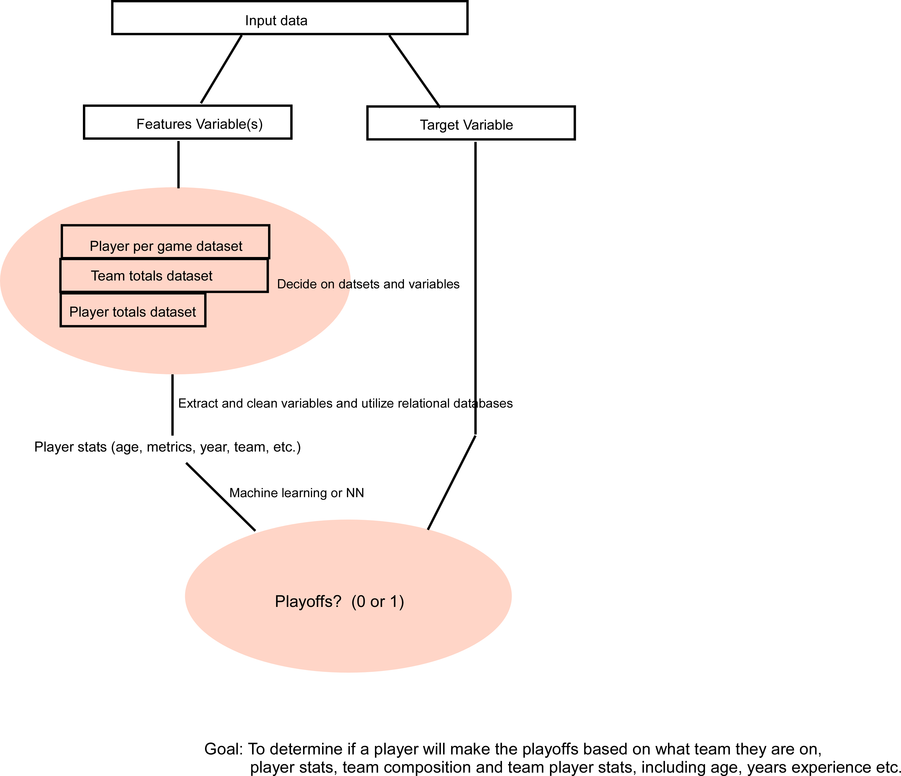

<h1>NBA Analysis Capstone Project</h1>
Our goal is to build a machine learning model that can (with reasonable accuracy) predict whether said player will make the NBA playoffs based a variety of factors such as: three point attempted vs made, experience level, etc (see image below). We picked this topic because we believe that it would be interesting if we can predict the success of a player within the NBA based off of their statistics.  

<h2>Machine Learning Model Overview</h2>

<b>Preliminary Data Processing: </b>We merged three datasets together: advanced_player_stats, team_stats, and player_totals (all downloaded from Kaggle).   

<b>Feature Selection: </b>After merging the datasets, we dropped multiple columns such as: season, team, abbreviation, player_id, etc. because they have no effect on whether a player makes it to the NBA playoffs or not.   

<b>Split and Training: </b>I split the datasets into 70% for training, and the remaining 30% for evaluating our model.   

<b>Model Choice: </b>For the time being, I decided to test two ensemble learning classifiers (balanced random forest and easy ensemble adaboost). Overall, I only achieved an accuracy of ~77% for both.   
Balanced Random Forest:

    Pros - it can handle datasets with higher dimensionalities, and identify most significant variables.

    Cons - May overfit noisy datasets.

Easy Ensemble ADABoost:

    Pros - Not as prone to overfitting as balaced random forest.

    Cons - Requires a quality dataset (outliers/noisy data should be avoided)

<h2>Dashboard Concept</h2>
Tools for final dashboard: Tableau
Demo Storyboard: <a>https://docs.google.com/presentation/d/1VQ8e_Y5QtRa-lqhXdS1Z7zf5Fnh6p61ZbZFkb3y1EK8/edit#slide=id.p</a>
- The dashboard will have a selector for the player name and filter the relevant graphs
- Colors will be used to distinguish the liklihood of making the playoffs
- The dashboard will be a mixture of machine learning analysis and relevant player stats

  

<h2>Project Structure</h2>
</img>
<ul>
    <li>Team Structure: Jack = Tableau visualizations/presentation, Dorian = GitHub repository/machine learning , Ari - database management/cleaning the datasets.</li>
    <li>Communication protocol - we are communicating via Slack and have scheduled biweekly meetings during classtime.</li>
    <li>Data used: we are using three NBA datasets downloaded from Kaggle.</li>

</ul> 