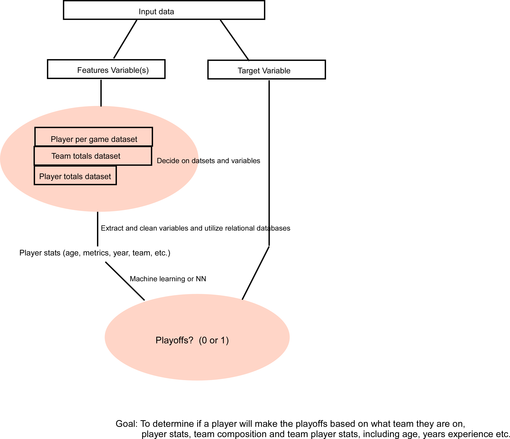

# NBA-Analysis  
<h2> Overview</h2>  
The goal of this project was to analyze a set of metrics for NBA players for each season between 1979 and 2021 and to construct a model that could predict with reasonable accuracy whether a player would make the playoffs. Player metrics were evaluated independent of player name and which team they played for - therefore allowing a focus on the metrics themselves. We obtained three datasets obtained from https://www.kaggle.com/sumitrodatta/nba-aba-baa-stats containing individual and team data beginning in 1947.      

<h3>Overall project schematic:  </h3>

   

<h2>Preliminary Data Processing:  </h2>

We utilized three datasets included in the resources folder: 

    advanced.csv   
    player_totals.csv  
    team_summaries.csv  
    team_totals.csv  

The advanced and player_totals datasets contain a large set of individual player metrics (features) sorted by player and season with features such as the team they played on, age, experience, and a variety of cumulative stats for each season.  Given our goal was to see whether features for players could be used to predict whether a player makes the playoffs on any given season, it was important to evaluate our data independent of team and player name.  After cleaning the said datasets to focus on  the years 1979-2021 and focus on most complete and relevant features, we obtained three datsets (all files are available in the resources folder):   

    advanced_stats_filtered.csv  
    player_totals_filtered.csv  
    team_summary_filtered.csv  

<h2> Data joining  </h2>

Cleaned datasets were uploaded to a remote relational database and merged to create a large dataset of player metrics resulting in the file: initial_merged_nba_data.csv.  

A final dataset was then created by merging this file to team_summary data which indicates whether the associated team made it to the playoffs for the season in question. The final dataset: final_nba_player_dataset.csv was then used for generating graphical/storytelling data and served as the data source for our Machine learning models.  An Entity Relationship diagram (nba_entity_relationship_diagram.png) showing the relational features for the datasets (Entities) is also included.  The included ipynb jupyter notebook: nba_players_teams.ipynb contains all code for this process including the merging of files.  Files were uploaded to the indicated relational database and can also be merged using  SQL methods.   

<h2> Machine learning Overview </h2>

<b>Feature Selection: </b>
The following features were dropped: season, player name, team name and games started.  This allows the model to focus mainly on player metrics.  

<b>Split and Training: </b>I split the datasets into 70% for training, and the remaining 30% for evaluating our model.  

<b>Model Choice: </b>I used two ensemble learning classifiers (balanced random forest and easy ensemble adaboost). Overall, I achieved an accuracy of ~77% for balanced random forest, and ~76% for the easy ensemble adaboost. Although our achieved accuracy score is not ideal, we believe that our model does a decent job for predicting our target. There are multiple factors outside of a players individual statistics that influence whether they make it to the playoffs or not. For example, how the team performed as a whole or which specific players were traded, and others.

Balanced Random Forest:

    Pros - it can handle datasets with higher dimensionalities, and identify most significant variables.
    Cons - May overfit noisy datasets.

Easy Ensemble ADABoost:

    Pros - Not as prone to overfitting as balaced random forest.
    Cons - Requires a quality dataset (outliers/noisy data should be avoided)

<h2><a href="https://public.tableau.com/app/profile/jack.hansley/viz/nba_stuff/Story1?publish=yes">Storyboard</a></h2>

 <ul>
 <li>The dashboard is focused around trends for different player stats and how they impact a player going to the playoffs</li>
 <li>Colors are used to distinguish whether a player goes to the playoffs</li>
 <li>The dashboard will be a mixture of machine learning analysis and relevant player stats</li>
 </ul>

 

<h2>Project Structure</h2>
(Refer to image below for a visual of how our project was structured)
<ul>
    <li>Team Structure: Jack = Tableau visualizations/presentation, Dorian = GitHub repository management/machine learning model, Ari - database management/cleaning the datasets.</li>
    <li>Data used: we are using three NBA datasets downloaded from Kaggle.</li>
</ul>
</img>
 